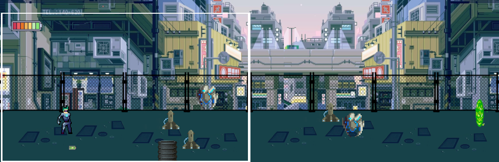
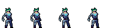
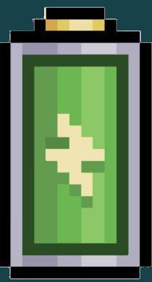
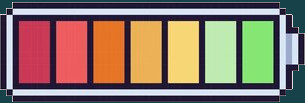
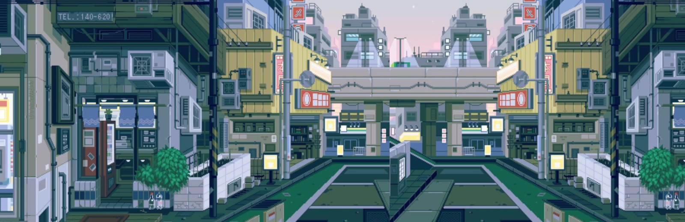
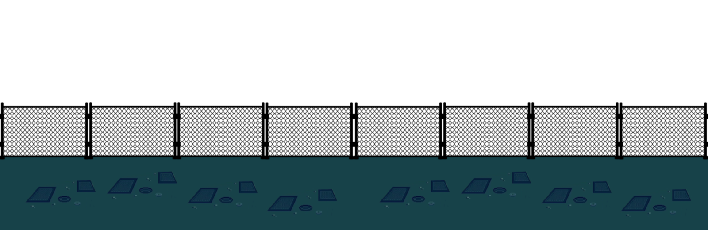

# Doku 

## Level 1

- Der weiße Rahmen ist die Kamera/Bildschirmauflösung -> Kamera moved mit
- Gegener sollen außerhalb der Kamera spawnen
- Maincharakter mit Idol-, Attack-, Spring- und Gehanimation 
- Maincharakter soll springen können
- wenn Maincharacter auf Gegner springt verliert man leben
- wenn alle Gegener tot dann geht Portal auf zum nächten Level 
- verschiedene Gegenertypen
- Gegnertyp 1 (schwach) 
- Gegnertyp 2 (mittel) 
- Leben kann man in Form von Collectables (Batterie aufsammeln) -> IMG zur Batterie 
- Lebensanzeige oben Links -> IMG zur Lebensanzeige 
- Hintergrund -> 
- Vodergrund (Spielbarer Bereich) 
